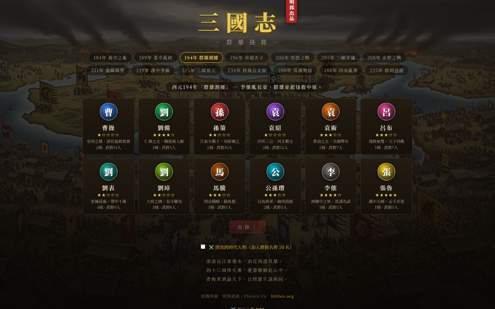
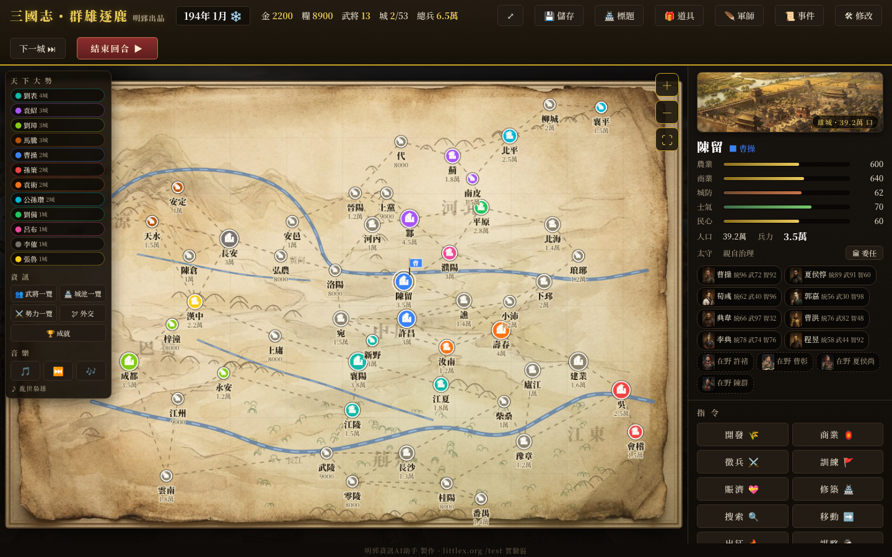
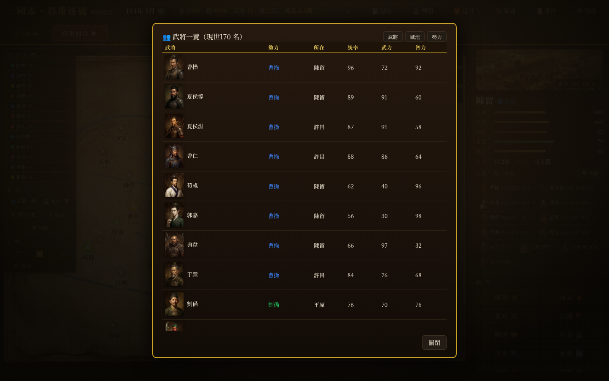
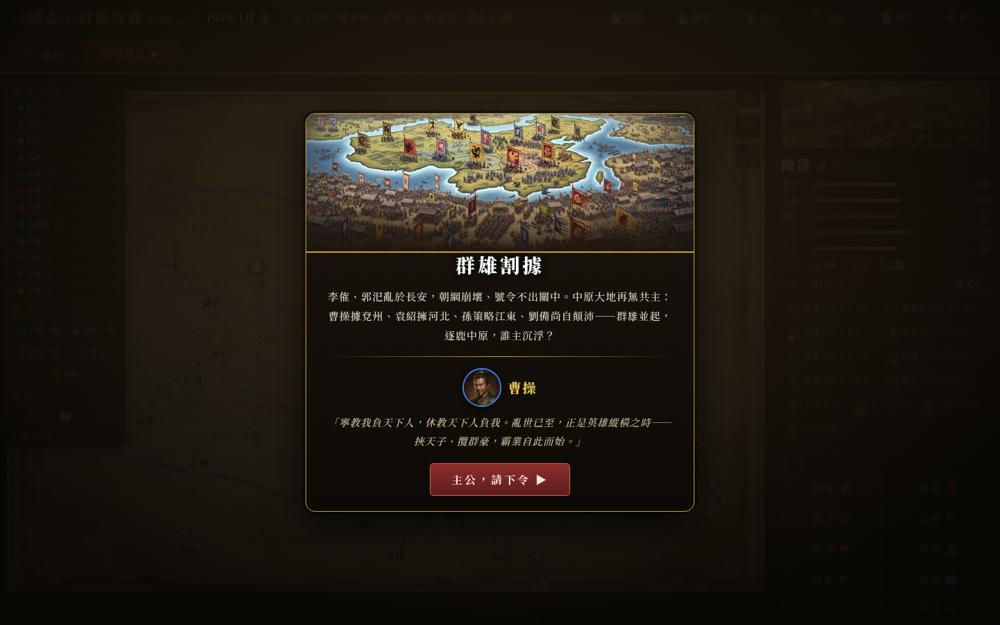

# 三國志・群雄逐鹿

**🎮 立即試玩 / Play Now / 今すぐプレイ： <https://littlex.org/game/sanguo/>**

免費線上三國志原創策略遊戲——免下載、免安裝，開瀏覽器就能玩。

---

## 遊戲簡介（繁體中文）

《三國志・群雄逐鹿》是一款向經典光榮《三國志》系列致敬的原創網頁策略遊戲。玩家從
14 個劇本（184 年黃巾之亂～234 年秋風五丈原，另有英雄集結、外族亂華等 IF 劇本）中
選擇一位君主，在 53 座城池的中原地圖上開發內政、招募武將、外交結盟、統兵征戰，
最終一統天下。

- **170+ 名武將**全數配有 AI 繪製肖像與百字史實／演義列傳
- **三國志IV式戰棋野戰**：38×24 地形戰場（山、河、林、渡口）、天氣風向、火計、
  單挑、名將專屬戰法（呂布無雙、關羽武聖、周瑜業火⋯⋯）與 65 名將史實對照
- **內政系統**：農業、商業、城防、徵兵、訓練、賑濟、搜索，太守委任自動治理
- **38 種成就**、34 種隨機事件（全螢幕演出）、單挑對決動畫
- **41 首 AI 生成交響配樂**（Lyria），依劇本、君主與場景動態切換

單一 HTML＋兩支 JS，無框架、無後端相依，純前端即可運行。

## Introduction (English)

*Romance of the Three Kingdoms: Heroes Contend* is an original browser-based
strategy game paying homage to KOEI's classic *Sangokushi* series. Choose your
warlord from 14 scenarios (184 AD Yellow Turban Rebellion through 234 AD
Wuzhangyuan, plus "what-if" scenarios), then develop your cities, recruit
officers, forge alliances, and wage war across a 53-city map of ancient China
to unify the land.

- **170+ officers**, each with an AI-painted portrait and a historical biography
- **RTK4-style tactical battles**: 38×24 terrain battlefield (mountains, rivers,
  forests, fords), weather & wind, fire attacks, duels, and 15 signature
  tactics for legendary generals
- **Domestic affairs**: agriculture, commerce, fortification, conscription,
  training, relief, and delegated governors
- **38 achievements**, 34 random events, animated duel cut-ins
- **41 AI-composed orchestral tracks** (Lyria) that shift with scenario,
  warlord, and scene

A single HTML file plus two JS files — no framework, no backend required.
Play instantly in any modern browser.

## ゲーム紹介（日本語）

『三國志・群雄逐鹿』は、コーエーの名作『三國志』シリーズへのオマージュとして
制作されたオリジナルのブラウザ戦略ゲームです。184年の黄巾の乱から234年の
五丈原まで、14本のシナリオから君主を選び、53都市の中原マップで内政・登用・
外交・戦争を繰り広げ、天下統一を目指します。

- **170名以上の武将**全員に AI 描画の肖像と史実・演義に基づく列伝を収録
- **三國志IV式ヘックス野戦**：38×24 の地形戦場（山・川・森・渡し場）、天候と
  風向き、火計、一騎打ち、名将専用戦法（呂布の無双、関羽の武聖など15種）
- **内政システム**：農業・商業・城防・徴兵・訓練・賑済・探索、太守への委任統治
- **実績38種**・ランダムイベント34種・一騎打ち演出
- **AI 作曲のオーケストラ BGM 41曲**（Lyria）がシナリオ・君主・場面で変化

HTML 1枚と JS 2本だけで動作。フレームワークもバックエンドも不要、
ブラウザを開くだけで今すぐ遊べます。

---

## 技術構成 / Tech Stack

| 項目 | 內容 |
|---|---|
| 前端 | Vanilla JavaScript（無框架）＋ Canvas 2D 戰棋渲染 ＋ Three.js（V2 戰棋備援） |
| 美術 | AI 生成（武將肖像、城池照片、地圖底圖） |
| 音樂 | Lyria 3 生成 41 首，Web Audio 合成引擎備援 |
| 存檔 | localStorage（3 個存檔槽＋成就跨劇本累積） |
| 架構 | `index.html`（UI/CSS）＋ `game.js`（主遊戲）＋ `rtkb.js`（野戰引擎） |

## 開發 / Credits

遊戲開發：**明郅資訊 / Phenix Fu** — <https://littlex.org>
